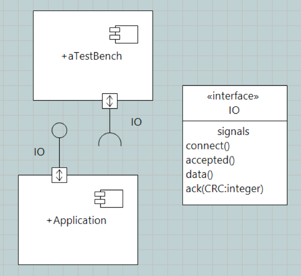
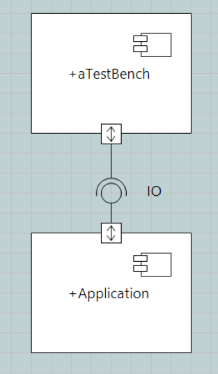
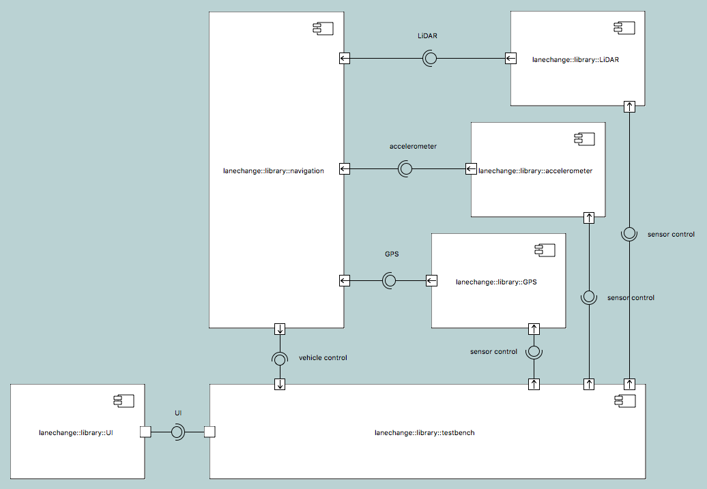
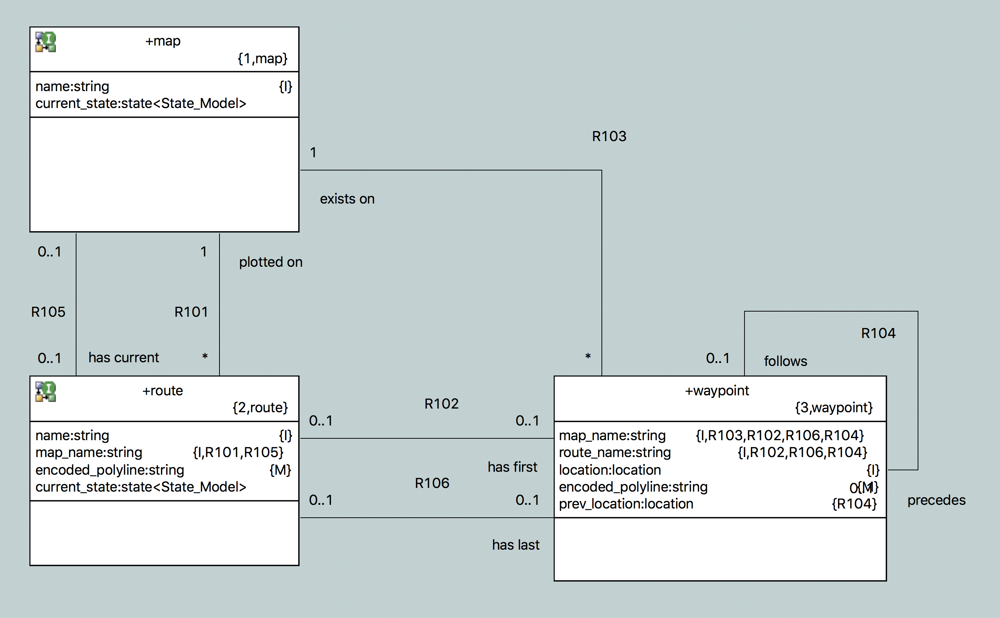

# Model-Based Testing for Self-Driving Car Navigation

## Self-Driving Car Testing

Self-driving cars pose challenges to testing.  The quantity and
magnitude of sensor inputs create an enormous test vector space.
Traditional manual testing methods are inadequate to cover this
multi-dimensional vector space with test cases.  To address this
challenge model-based techniques are applied to manage the testing
complexity.  Abstraction and automation increase the productivity of the
test engineering.  Model-based test engineering allows generation of
test cases, test data and predicted behavior.  Sensor test generation,
automated Navigation testing and turbulence induced testing are elements
of a strategy to improve the efficiency of testing for self-driving
cars.  A case study is provided as an example.  Conclusions are then
summarized.

### Sensor Test Generation

Self-driving cars employ many sensors as input to the Navigation.
Global positioning (GPS), enhanced GPS, LiDAR, accelerometers and
cameras are just a few of the sensors used in Navigation.  A model-based
engineering approach abstracts the sensors with models.  By modeling the
sensors, automated test vector generation is enabled.  A component
represents functionality exposed through explicit interfaces.  Thus, the
internal behavior of the component can be abstracted and modeled using a
variety of techniques including C coding, Ruby scripting, Executable UML
modeling or other methods of encoding behavior.

The interface to a sensor component provides a simple way of providing
input data to the application Navigation component.  The modeled
interface between the Navigation application and the sensor components
enables injection of file-based test input data.  A standardized method
of reading pre-recorded or pre-calculated sensor data has been modeled
and is part of the test bench modeling configuration.  Carefully
pre-calculated and simulated sensor data is important for exploring the
requirements of sensors.  Data recorded during actual drives is useful
to stimulate the Navigation application in the laboratory environment.
Recording sensor input is an efficient means of gathering a portion of
the data required for automated testing of the self-driving car.

### Test Generation for the Navigation Application

When an application is modeled at an abstract level, its behavior is
captured in a model that can be executed and tested.  This model
predicts correct behavior based on correct input.  The same model can be
used to detect and grade incorrect input.  Since the model does not
physically crash like a vehicle in the real world, it can be used to
explore erroneous and noisy data and used to develop recovery from bad
sensor input.

The same model can be manipulated to _generate_ its own input.  Given a
route, a Navigation application can automatically produce the sensor
input that would cause the self-driving car to follow the route.  This
capability can be used to automatically produce the massive quantity of
test vector data needed to exercise the production system.

### Automatic Generation of Turbulence

The above elements can now be combined to produce test cases and test
data that contain measured amounts of turbulence (noise).  With simple,
abstract models of sensors and the application under test, we can
automate the generation of tests including prescribed levels of noise.
The ability to introduce turbulence into one or more sensors allows
exploration of test scenarios involving faulty or noisy data coming from
a combination of sensors.  The test cases and test data are used to test
the Navigation application in a simulation environment first and then in
production.

### Case Study

#### Case Study Requirements

A model shall be built that demonstrates model-based testing in thecontext of self-driving cars.  
  - The model shall be fed input GPS data.  
  - The model shall have a navigation module that interprets GPS data and outputs verbal instructions.  
  - The design of the model shall consider a mechanism for injecting turbulence into the input GPS data.  

#### Test Benching Concept

'Test Benching' is the concept of substituting a test bench component in
place of a compatible functional component.  A component requires and
interface.  Another component with the same interface is considered
compatible.  Therefore, a test bench component can be substituted for
any component in a system as long is it has compatible interfaces.

Here is an example application component with its corresponding test
bench component and interface.

Now the application and test bench are _wired_ together to run the test.

#### Case Study Model

##### Self-Driving Car Navigation System

The system model is made up of a test bench component, a Navigation
component, and three sensor components.  This model focuses on the GPS
sensor component.

##### Testbench

The test bench initiates the simulation.  For each sensor, the test bench
component passes a data file of simulated data and starts a global tick
that moderates the frequency at which data points are consumed by the
sensors.  In the current case study the GPS component is the only
component which is initialized and passed a data file.

##### Sensors

Internally, each sensor has a state machine to manage delivering sensor events
on a tick (provided globally by the testbench). After each tick, the next data
point is read and passed to the navigation module via an interface signal.

##### Test data

A model of data is provided to allow the sensors to read data from a file. An
external entity written in native C parses and populates the model. Once the
model is populated, the reader class can supply the next data point on demand.

##### Navigation

The navigation module receives GPS location events and
populates a map route. To produce verbal instructions from the GPS coordinates
(i.e. to detect when a turn is made and notify the user), knowledge of map data
and complex mapping algorithms are needed. Because this is the module that must
be tested and this model focuses on testing, no attempt was made to implement a
solution from scratch.

Valhalla [[2.3]](#2.3) is an open source project dedicated to complex mapping
operations using data from OpenStreetMap [[2.4]](#2.4). Mapzen [[2.5]](#2.5) is
an open platform for mapping applications which provides web APIs for many
mapping operations and uses Valhalla behind the scenes. The Mapzen API was
chosen to implement the navigation module.

For navigation _map matching_ needs to be applied to the GPS route produced from
the GPS events. Map matching attempts to overlay a route of real GPS points over
a map with some tolerance for imprecise GPS data. We can then use this
theoretical route from the map to harvest verbal instructions when a turn is
made. To invoke this map matching, Mapzen requires a GPS route be encoded as a
polyline [[2.6]](#2.6), which is an algorithm developed by Google to encode many
GPS lat/lon pairs into a readable ASCII string. An external entity is provided,
written in native C, to encode the modeled map route into a polyline. Another
external entity is provided to call the Mapzen web API and return the most
recent instruction (if changed). The navigation module prints this instruction.

#### Case Study Demo

See a demo of the application linked in [[2.7]](#2.7). This shows the
application running with data from the following GPS path.

##### Turbulence

Because manufactured GPS data is being used, a consistent method of injecting
noise into the data is required.  A mechanism can be implemented in the GPS
sensor component itself to disturb the data in a measured way.
Alternatively, a mechanism can be implemented outside the scope of this model
in the utility that collects or produces the GPS data.  The collected/calculated
data can have differing amounts of turbulence added to each location point.

## Conclusion:  Model-Based Self-Driving Car Testing

Self-driving cars are complex to test.  Managing this complexity is an
important consideration for efficient coverage.  By modeling the sensors,
Navigation application and interfaces between components, automation
becomes possible.  Automated test case generation and test data generation
serve to cover more of the input vector space than can be done manually.
Model-based techniques increase abstration and enable automation.  This
increases the productivity of the testing engineering.  The simple case
study illustrating some simple ways that the model of the sensors is useful
for injecting turbulence.  The case study also demonstrated how modeling
the Navigation application is useful to grade the quality of the input
data and identify correct behavior.  Even though the case study did not
demonstrate the injection of turbulent noise data, it did discuss various
ways such noise can be engineered in the context of the model.

#### Document References

2.1 [#9339 Model-Based Turbulence Testing](https://support.onefact.net/issues/9339)
2.2 [#9405 build model of turbulence testing](https://support.onefact.net/issues/9405)
2.3 [Valhalla](https://github.com/valhalla/valhalla)  
2.4 [OpenStreetMap](https://www.openstreetmap.org/about)  
2.5 [Mapzen](https://mapzen.com/)  
2.6 [polyline algorithm](https://developers.google.com/maps/documentation/utilities/polylinealgorithm)  
2.7 [turbulence model demo](https://www.youtube.com/watch?v=GeR_t-eA2JU)  
2.8 [turbulence model](https://github.com/xtuml/models/tree/master/applications/lanechange)  

